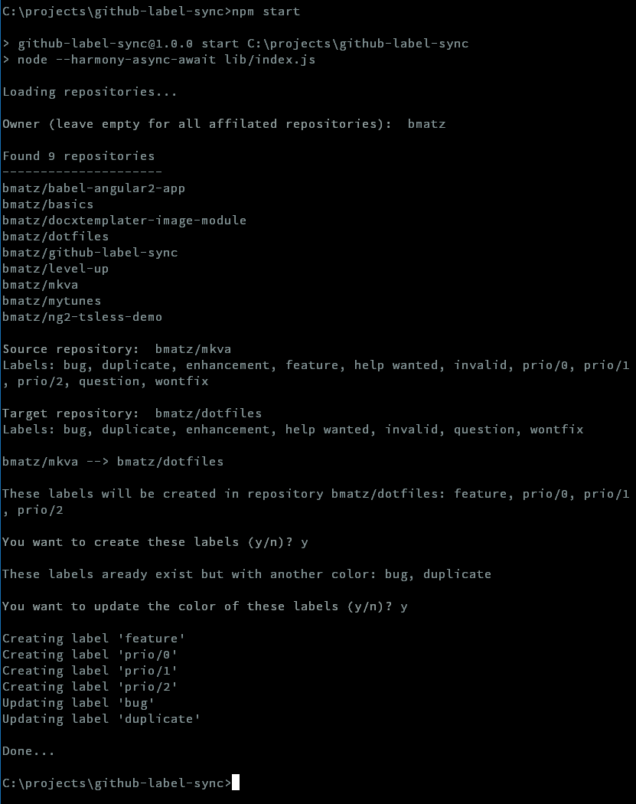

# github-label-sync

Node driven CLI for syncing labels between github repositories.

The Application will only

* list your repositories
* create new labels
* update colors of existing labels

## Installation

Install via git clone

```bash
$ git clone https://github.com/bmatz/github-label-sync.git
$ cd github-label-sync
$ npm install
```

Run the application

```bash
$ npm start
```

## API Token

You will be prompted for a GitHub API token. You can enter your API token on the prompt, provide it via an CLI Argument or an environment variable (GITHUB_API_TOKEN).
You can create a new GitHub API token here -> [https://github.com/settings/tokens](https://github.com/settings/tokens). Make sure to check 'repo - Full control of private repositories';

Linux
```bash
$ source GITHUB_API_TOKEN=123456789abcdef
```

Windows
```
set GITHUB_API_TOKEN=123456789abcdef
```

## CLI Arguments

* -o, --owner
	* filter affilated repositories
* -s, --source
	* source repository
* -d, --destination
	* destination repository
* -c, --create
	* don't ask for create permission
* -u, --update
	* don't ask for udpate permission
* -t, --token
	* GitHub API token

### Examples

Will list all according repositories which are affilated with the entered owner and your provided token.
```bash
$ npm start -- --owner bmatz --token 123456789abcdef
```

Automatically create and update labels in your destination repository based on your source repository.
If all provided values are correct it will run without any further user interaction.
```bash
$ npm start -- --source bmatz/sourcerepo --destination bmatz/destinationrepo --create --update --token 123456789abcdef
```

## Changelog
* 1.1.0  
	* Added CLI Arguments
	* It is now possible to select public repositories as source
* 1.0.0
	* Basic Application

## Screenshot



## LICENSE

MIT license. See the LICENSE file for details.
